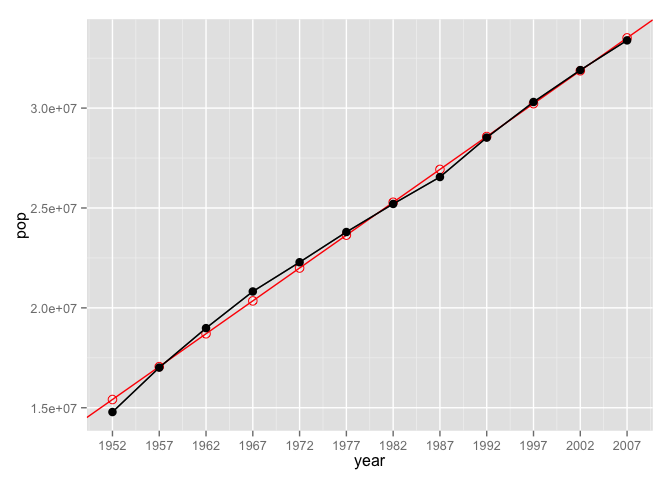
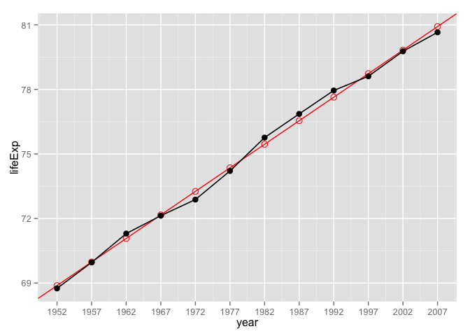
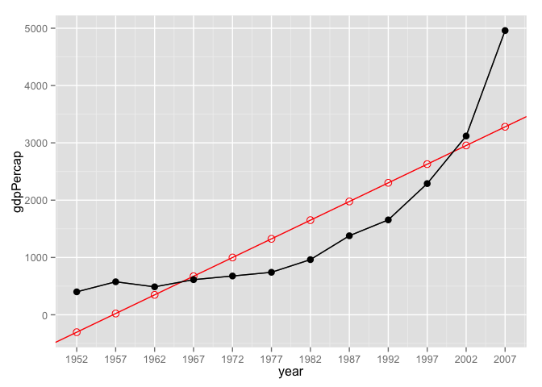

About packageForGapminder
=========================

`packageForGapminder` is a package which makes model pop/lifeExp/gdpPercap VS year for countries in gapminder dataset easier, as well as makes it possible to use only one line code to help you get a intuitive view on how well pop/lifeExp/gdpPercap and year in gapminder dataset fits a linear model. All functions here are based on my [homework4](https://github.com/STAT545-UBC/lina_qiu/blob/master/STAT545/Homework04/Homework04.md) for STAT545.

To install the package:

``` r
##Make sure you load devtools package first
library(devtools)
##Install packageForGapminder
devtools::install_github("LinaQiu/packageForGapminder")
```

Load packages here:

``` r
library(packageForGapminder) 
```

    ## Loading required package: dplyr
    ## 
    ## Attaching package: 'dplyr'
    ## 
    ## The following objects are masked from 'package:stats':
    ## 
    ##     filter, lag
    ## 
    ## The following objects are masked from 'package:base':
    ## 
    ##     intersect, setdiff, setequal, union
    ## 
    ## Loading required package: gapminder
    ## Loading required package: ggplot2

``` r
library(knitr)
options(knitr.table.format="markdown")        #Set the format for tables as "markdown"
```

In this package, we have three functions in total. See below.

-   `gapminder_lmfit()`: Fit a linear model to pop/lifeExp/gdpPercap VS year for a country in gapminder dataset.

-   `gapminder_lm_table()`: Create a table for fitted linear model between variables pop/lifeExp/gdpPercap and year in gapminder dataset.

-   `gapminder_lm_plot()`:Draw a plot to show how well pop/lifeExp/gdpPercap and year in gapminder dataset fits a linear model.

Besides, by default, all these three funtions will fit the linear model to data `pop` VS `year` for a gapminder country.

Using `gapminder_lmfit()`:
==========================

Fit linear model to gapminder country data.

``` r
gapminder_lmfit("Canada")                   ##fit a linear model to pop VS year for "Canada"
```

    ## [[1]]
    ## intercept 
    ##  15412220 
    ## 
    ## [[2]]
    ##    slope 
    ## 329118.1 
    ## 
    ## [[3]]
    ## fitError(sumOFres^2) 
    ##         983734892937 
    ## 
    ## [[4]]
    ##  residuals          2          3          4          5          6 
    ## -626635.53  -47656.04  282448.45  470775.94  289918.43  156227.92 
    ##          7          8          9         10         11         12 
    ##  -83862.59 -381653.10  -53441.61   83308.88   34143.37 -123574.14

``` r
gapminder_lmfit("Canada","year","lifeExp")  ##fit a linear model to lifeExp VS year for "Canada"
```

    ## [[1]]
    ## intercept 
    ##  68.88385 
    ## 
    ## [[2]]
    ##     slope 
    ## 0.2188692 
    ## 
    ## [[3]]
    ## fitError(sumOFres^2) 
    ##            0.6212471 
    ## 
    ## [[4]]
    ##   residuals           2           3           4           5           6 
    ## -0.13384615 -0.01819231  0.22746154 -0.03688462 -0.38123077 -0.14557692 
    ##           7           8           9          10          11          12 
    ##  0.31007692  0.31573077  0.31138462 -0.12296154 -0.05730769 -0.26865385

``` r
gapminder_lmfit("China","year","gdpPercap") ##fit a linear model to gdpPercap VS year for "China"
```

    ## [[1]]
    ## intercept 
    ## -303.7785 
    ## 
    ## [[2]]
    ##    slope 
    ## 65.16677 
    ## 
    ## [[3]]
    ## fitError(sumOFres^2) 
    ##              5482861 
    ## 
    ## [[4]]
    ##  residuals          2          3          4          5          6 
    ##  704.22712  553.93165  139.78482  -61.01736 -322.65682 -584.15330 
    ##          7          8          9         10         11         12 
    ## -688.80324 -598.15446 -647.10817 -339.49205  164.72085 1678.72096

Using `gapminder_lm_table()`:
=============================

Get the table which compares the actual pop/lifeExp/gdpPercap values with the predicted values that we compute from the linear model.

``` r
table1 <- gapminder_lm_table("Canada")
kable(table1)
```

|     x|  predicted\_y|  actual\_y|    D\_value|
|-----:|-------------:|----------:|-----------:|
|  1952|      15412220|   14785584|  -626635.53|
|  1957|      17057810|   17010154|   -47656.04|
|  1962|      18703401|   18985849|   282448.45|
|  1967|      20348991|   20819767|   470775.94|
|  1972|      21994582|   22284500|   289918.43|
|  1977|      23640172|   23796400|   156227.92|
|  1982|      25285763|   25201900|   -83862.59|
|  1987|      26931353|   26549700|  -381653.10|
|  1992|      28576944|   28523502|   -53441.61|
|  1997|      30222534|   30305843|    83308.88|
|  2002|      31868125|   31902268|    34143.37|
|  2007|      33513715|   33390141|  -123574.14|

``` r
table2 <- gapminder_lm_table("Canada","year","lifeExp")
kable(table2)
```

|     x|  predicted\_y|  actual\_y|    D\_value|
|-----:|-------------:|----------:|-----------:|
|  1952|      68.88385|     68.750|  -0.1338462|
|  1957|      69.97819|     69.960|  -0.0181923|
|  1962|      71.07254|     71.300|   0.2274615|
|  1967|      72.16688|     72.130|  -0.0368846|
|  1972|      73.26123|     72.880|  -0.3812308|
|  1977|      74.35558|     74.210|  -0.1455769|
|  1982|      75.44992|     75.760|   0.3100769|
|  1987|      76.54427|     76.860|   0.3157308|
|  1992|      77.63862|     77.950|   0.3113846|
|  1997|      78.73296|     78.610|  -0.1229615|
|  2002|      79.82731|     79.770|  -0.0573077|
|  2007|      80.92165|     80.653|  -0.2686538|

``` r
table3 <- gapminder_lm_table("China","year","gdpPercap")
kable(table3)
```

|     x|  predicted\_y|  actual\_y|    D\_value|
|-----:|-------------:|----------:|-----------:|
|  1952|    -303.77851|   400.4486|   704.22712|
|  1957|      22.05535|   575.9870|   553.93165|
|  1962|     347.88920|   487.6740|   139.78482|
|  1967|     673.72306|   612.7057|   -61.01736|
|  1972|     999.55691|   676.9001|  -322.65682|
|  1977|    1325.39077|   741.2375|  -584.15330|
|  1982|    1651.22462|   962.4214|  -688.80324|
|  1987|    1977.05848|  1378.9040|  -598.15446|
|  1992|    2302.89233|  1655.7842|  -647.10817|
|  1997|    2628.72619|  2289.2341|  -339.49205|
|  2002|    2954.56004|  3119.2809|   164.72085|
|  2007|    3280.39390|  4959.1149|  1678.72096|

Using `gapminder_lm_plot()`:
============================

Draw a plot to give you an intuitive view on how well a gapminder country data(pop/lifeExp/gdpPercap VS year) fits a linear model.

``` r
gapminder_lm_plot("Canada")
```



``` r
gapminder_lm_plot("Canada","year","lifeExp")
```



``` r
gapminder_lm_plot("China","year","gdpPercap")
```



`packageForGapminder` really makes it easier to check the linear relationships between `pop/lifeExp/gdpPercap` and `year` for a gapminder country. Enjoy it!
